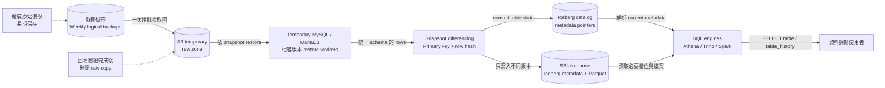
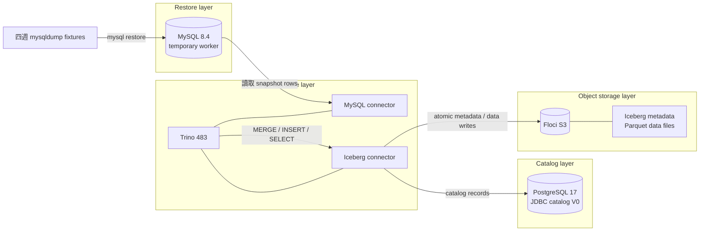

# RDBMS Snapshot Lakehouse PoC

這個 PoC 驗證如何把長期留存的 MySQL／MariaDB 每週 logical full backup，
轉換成可直接用 SQL 查詢、去除連續重複資料、支援 schema 演進的歷史湖倉。

它處理的核心困境是：當使用者要求調閱 2005～2015 年資料時，不再逐週
restore 數百份 full backup，也不再把相同資料重複輸出數百次。

## 適用情境

適合：

- 僅保有 weekly `mysqldump` 或其他 logical full backup。
- 沒有可回放的 binlog／CDC 歷史。
- 需要一次回填多年備份，之後長期保留可查詢版本。
- 每張來源表具有穩定 primary key。
- 需要 `table1` 最新狀態及 `table1_history` 歷史版本兩個介面。
- 接受歷史欄位不存在時，在統一 schema 中顯示為 `NULL`。

不適合：

- 要求還原兩次 weekly backup 之間的每一筆 DML。
- 要求精確的 DML 時間、操作者、transaction ID 或法律稽核證據。
- 主鍵跨年代改變，且必須推導新舊鍵代表同一業務實體。

weekly snapshot 只能證明「某版本在某次備份被觀測到」。若一筆資料在兩次
備份之間多次修改，最後又改回原值，中間版本無法由 logical full backup
推導。這是來源證據的限制，不是 Iceberg 能補足的功能。

## 資料語意

PoC 使用 snapshot differencing，不使用 binlog CDC：

1. 依時間順序 restore 每份 logical backup。
2. 以來源表 primary key 識別同一列。
3. 對統一後的 row content 計算 `row_hash`。
4. 與目前 active history version 比較。
5. hash 相同：不新增版本。
6. hash 不同：關閉舊版本並新增版本。
7. 主鍵從下一份 full snapshot 消失：只關閉舊版本，不新增 tombstone。

歷史期間採半開區間：

```text
valid_from <= query_time < valid_to
```

`valid_from`／`valid_to` 是首次觀測邊界，不是實際 DML timestamp。

## 對外資料物件

每張來源表維持兩個邏輯物件：

```text
table1          最新一份快照的狀態
table1_history  所有觀測到且內容不同的版本
```

不會產生 `table1_v1`、`table1_v2` 等大量版本表。

`table1_history` 的技術欄位：

| 欄位 | 用途 |
|---|---|
| `valid_from` | 首次觀測到此內容版本的快照日期 |
| `valid_to` | 下一版本或消失首次被觀測到的日期；active version 為 `NULL` |
| `source_snapshot` | 建立此版本的來源備份識別 |
| `row_hash` | 判斷內容是否與 active version 相同 |

## Schema 演進規則

來源 schema 可能從 10 欄增加至 20 欄，也可能從 20 欄減少至 10 欄。
查詢層維持統一 schema：

- 新欄位出現前的歷史資料：該欄位顯示 `NULL`。
- 欄位從來源移除後：舊版本仍保留歷史值，新版本顯示 `NULL`。
- Iceberg 以 column ID 管理 schema evolution；PoC 實際執行
  `ALTER TABLE ... ADD COLUMN email`。

這個選擇讓使用者可以直接：

```sql
SELECT *
FROM iceberg.history.table1_history
WHERE valid_from < DATE '2016-01-01'
  AND (valid_to IS NULL OR valid_to >= DATE '2005-01-01');
```

## 架構



正式環境的資料載體分工：

- 磁帶：原始 weekly backup 的權威長期保存來源。
- S3 raw zone：一次性回填暫存；驗證成功後刪除，避免永久保存第二份原件。
- S3 lakehouse zone：長期保存去重後的 Iceberg／Parquet。
- Catalog：記錄 Iceberg table metadata pointer，不保存實際業務資料。

本機 PoC 架構：



元件版本固定於 [`compose.yaml`](compose.yaml)：

- Floci：本機 S3-compatible object storage。
- MySQL 8.4：temporary logical-backup restore worker。
- Trino 483：Iceberg SQL engine。
- Apache Iceberg 1.11.0：由 Trino 483 image 提供。
- PostgreSQL 17：Iceberg JDBC catalog，只保存 catalog records。

Floci Athena 可以驗證 Glue-backed plain Parquet，但目前 PoC 的完整 Iceberg
讀寫由 Trino 驗證。正式上線前仍須在真實 AWS Athena + Glue + S3 進行一次
相容性測試。

## PoC 測試資料

[`fixtures/`](fixtures/) 包含四份可重現的 logical backup：

| Snapshot | Source schema | 驗證事件 |
|---|---|---|
| 2005-01-02 | `id, name, city` | 初始資料 |
| 2005-01-09 | `id, name, city` | 完全相同，應新增 0 個版本 |
| 2005-01-16 | 新增 `email` | 內容變更、新資料、schema add |
| 2005-01-23 | 移除 `city` | 內容變更、資料消失、schema drop |

預期結果：

```text
id=101: 3 versions
id=102: 2 versions
id=103: 1 version，第四週消失時關閉 valid_to
total:  6 history versions
active: 2 current rows
duplicate (PK + row_hash): 0
```

## 環境準備

需要：

- macOS 或 Linux。
- Docker Engine 與 Docker Compose。
- AWS CLI v2。
- `curl`、Bash。
- 約 6 GiB 可用記憶體。
- 首次下載 container images 所需網路連線。

本機目前使用 Colima；腳本會在未設定 `DOCKER_HOST` 時嘗試取得 `colima`
context。專案內 [`docker-config/config.json`](docker-config/config.json) 用於避開
不存在的 Docker Desktop credential helper，公開 images 不需要登入。

確認工具：

```bash
docker --version
docker compose version
aws --version
```

若使用 Colima：

```bash
colima start
docker info
```

## 如何執行

```bash
mkdir -p ~/rdbms-snapshot-lakehouse-poc
cd ~/rdbms-snapshot-lakehouse-poc
./scripts/run-poc.sh
```

腳本會：

1. 啟動 Floci、PostgreSQL、MySQL 與 Trino。
2. 建立 Floci S3 bucket `lakehouse`。
3. 初始化 Iceberg JDBC catalog V0 tables。
4. 重建 `table1_history`。
5. 依序 restore 四份 `mysqldump` fixtures。
6. 執行 snapshot diff、Iceberg `MERGE` 與 `INSERT`。
7. 建立最新狀態的 `table1`。
8. 驗證版本數、active rows 與重複版本。
9. 輸出 `table1_history` 與 `table1`。

腳本可重跑：保留 `history` namespace，但每次重建 PoC 的兩張 Iceberg tables
並從第一份 fixture 重新處理。

## 查詢方式

列出所有歷史版本：

```bash
./scripts/trino.sh \
  "SELECT * FROM iceberg.history.table1_history ORDER BY id, valid_from"
```

列出最新狀態：

```bash
./scripts/trino.sh \
  "SELECT * FROM iceberg.history.table1 ORDER BY id"
```

查詢 2005～2015 有效期間重疊的版本：

```bash
./scripts/trino.sh \
  "SELECT *
   FROM iceberg.history.table1_history
   WHERE valid_from < DATE '2016-01-01'
     AND (valid_to IS NULL OR valid_to >= DATE '2005-01-01')
   ORDER BY id, valid_from"
```

檢查 Iceberg snapshots：

```bash
./scripts/trino.sh \
  'SELECT * FROM iceberg.history."table1_history$snapshots" ORDER BY committed_at'
```

列出 Floci S3 中的 Parquet 與 metadata：

```bash
AWS_ACCESS_KEY_ID=test \
AWS_SECRET_ACCESS_KEY=test \
AWS_DEFAULT_REGION=us-east-1 \
aws --endpoint-url http://localhost:4566 \
  s3 ls s3://lakehouse/warehouse/ --recursive
```

## 停止與清理

停止服務但保留 named volumes：

```bash
docker compose down
```

刪除本 PoC 的 container data：

```bash
docker compose down -v
```

`down -v` 會刪除本 PoC 的 Floci S3、MySQL、PostgreSQL catalog 與 Trino
named volumes；fixtures 與程式碼不受影響。

## 驗證與設計紀錄

- [`docs/decision-record.md`](docs/decision-record.md)：訪談確認的設計決策。
- [`docs/validation.md`](docs/validation.md)：實際執行結果與 storage evidence。
- [`catalog/init.sql`](catalog/init.sql)：Iceberg JDBC catalog V0 schema。
- [`scripts/run-poc.sh`](scripts/run-poc.sh)：完整可重跑 pipeline。

## 正式化前的必要工作

PoC 已證明語意與元件互通，但全量 2000～現在之前仍需：

1. 從備份 catalog 盤點 dump 數量、總容量與最大單份容量。
2. 建立 `backup → MySQL/MariaDB engine/version` compatibility matrix。
3. 測量磁帶批次取回、SQL replay、Parquet 壓縮與 Iceberg commit 吞吐量。
4. 決定 worker concurrency、失敗重跑與 checkpoint 策略。
5. 為每個 snapshot／table 保存 row count、PK uniqueness、checksum 與狀態。
6. 設計 large-table partition／bucket 與 Parquet compaction，避免小檔案。
7. 估算 temporary S3 byte-days、長期 compressed byte-months、requests、
   query scan bytes 與 compute 成本。
8. 驗證 encryption、IAM、network、資料遮罩與 retention policy。
9. 在真實 AWS Athena + Glue + S3 執行 production compatibility gate。

成本模型：

```text
一次性成本 = raw S3 staging byte-days + restore compute + conversion compute
長期成本   = compressed Iceberg byte-months + S3 requests + query scanned bytes
```

原始 dump 已由磁帶長期保存時，不建議在 S3 再永久保存一份；只需保留精簡的
來源識別、checksum、row count 與處理紀錄，以控制長期儲存成本。
